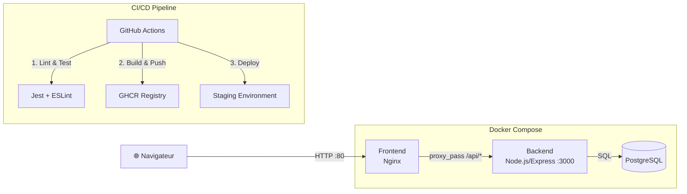

# VitalSync — Suivi médical et sportif

## Description
VitalSync est une application de suivi médical et sportif composée d'une API REST (Node.js/Express), d'un frontend (HTML/Nginx) et d'une base de données PostgreSQL. Le projet est entièrement conteneurisé et dispose d'une chaîne CI/CD automatisée.

## Architecture


## Prérequis
- Docker >= 24.0
- Docker Compose >= 2.20
- Git >= 2.40
- Node.js >= 20 (pour le développement local)

## Installation et lancement

### Cloner le projet
```bash
git clone https://github.com/hediboissard/vitalsync.git
cd vitalsync
```

### Configurer l'environnement
```bash
cp .env.example .env
# Éditer .env avec vos valeurs
```

### Lancer avec Docker Compose
```bash
docker-compose up --build -d
```

### Vérifier le fonctionnement
```bash
# Frontend
curl http://localhost

# Backend health check
curl http://localhost:3000/health

# Voir les logs
docker-compose logs -f
```

### Arrêter les services
```bash
docker-compose down       # Arrête les conteneurs (données conservées)
docker-compose down -v    # Arrête et supprime les volumes (données perdues)
```

## Pipeline CI/CD

La pipeline GitHub Actions se déclenche sur :
- **Push sur `develop`** : Validation continue du code
- **Pull Request vers `main`** : Validation avant mise en production

### Étapes :
1. **Lint & Tests** : ESLint + Jest (tests unitaires)
2. **Build Docker** : Construction et push des images sur GHCR (tag SHA + latest)
3. **Déploiement staging** : Lancement des services + health check automatique

## Stack technique
| Composant | Technologie | Justification |
|-----------|------------|---------------|
| Backend | Node.js 20 + Express | Léger, performant pour une API REST, large écosystème |
| Frontend | Nginx (Alpine) | Serveur HTTP performant, reverse proxy intégré |
| Base de données | PostgreSQL 16 | Robuste, ACID, adapté aux données médicales |
| Conteneurisation | Docker + Compose | Standard de l'industrie, reproductibilité |
| CI/CD | GitHub Actions | Intégré à GitHub, gratuit pour repos publics |
| Registry | GHCR | Intégré à GitHub, auth via GITHUB_TOKEN |

## Structure du projet
```
vitalsync/
├── backend/
│   ├── server.js
│   ├── package.json
│   ├── Dockerfile
│   ├── .dockerignore
│   ├── .eslintrc.json
│   └── test/
│       └── health.test.js
├── frontend/
│   ├── index.html
│   ├── nginx.conf
│   └── Dockerfile
├── k8s/
│   ├── backend-deployment.yaml
│   ├── backend-service.yaml
│   ├── frontend-ingress.yaml
│   └── db-secret.yaml
├── .github/workflows/
│   └── ci-cd.yml
├── docker-compose.yml
├── .env.example
├── .gitignore
└── README.md
```

## Licence
Projet réalisé dans le cadre de l'épreuve E6 — EFREI 2026.
